# Библиотека для рендеринга порталов PT

При создании этой библиотеки я не ставил перед собой цель создать что-то, чем будут пользоваться люди, что будет работать быстрее аналогов, что будет использовать последние научные достежиян итд. Я хотел лишь улучшить свои навыки кодинга, переделать и отрефакторить [ray-tracing](https://github.com/optozorax/ray-tracing), и рендерить всякие портальные штуки.

Отличительной особенностью данного репозитория является возможность телепортировать свет от точечных источников света через порталы. К сожалению этот алгоритм написан крайне неоптимальным образом, а просто так, чтобы работал. По аналогии с ним можно сделать такие алгоритмы для точечных источников света: 
* Отражение от полигональных зеркальных поверностей.
* Преломление от полигональных стекляных поверхностей.

Надеюсь эти красивые картинки вдохновят на создание чего-то большего.

# Фичи

* **Полиморфизм.**
  * **Различные подходы к рендерингу.** - одну и ту же сцену можно рендерить различными классами и получать соответственно различную скорость и фотореалистичность.
    * **Ray Tracing** - обычная трассировка лучей, которая может отобразить картинку с малым количеством семплов. Трейсинг лучей останавливается при достижении материала с цветом, и рендерит вторичные лучи, только если попадает на преломляющую или зеркальную поверхность.
    * **Path Tracing** -  методика рендеринга в компьютерной графике, которая стремится симулировать физическое поведения света настолько близко к реальному, насколько это возможно. Трейсинг лучей останавливается только при достижении предела отражений, или при достижении источника света.
  * **Полиморфизм объектов** - имеется два типа объектов: object и shape.
    * **Object** - объект, котороый неразрывно связан со своим собственным материалом, например: небо, cubemap, текстурированный полигон.
    * **Shape** - объект, которому можно задать любой имеющийся материал, например, это объекты: сфера, цилиндр, полигон, треугольник, портал, контур (состоит из сфер и цилиндров).
  * **Полиморфизм камер** - можно рендерить картинку совершенно различными камерами, которые наследуются от абстрактного класса базовой камеры и реализуют виртуальные методы. Таким образом уже реализованы камеры: перспективная, ортогональная, 360. Так же можно реализовать другие камеры, например: проекцию Панини, камера для создания cubemap.
  * **Полиморфизм материалов** - любому объекту можно задать любой материал на его поверхности, например реализованы такие материалы, как: 
    * рассеивающий, 
    * отражающий, 
    * стекло, 
    * освещение. 
    Аналогично для реализации материала надо наследоваться от базового класса материала и реализовать метод обработки луча материалом.
* **Точечные источники света** поддерживаются на уровне рендерера.
* **Рендеринг порталов.** Портал является shape, потому что можно задать какой материал будет на двух его задних частях. Он сам задается как полигон и две системы координат.
  * Поддерживается **телепортирование освещения** от точечных источников света через порталы. При этой телепортации учитывается, что некоторая часть света может не пройти через портал.
* **Считывание произвольной сцены из многоугольников, с анимацией, из `json`файла.**
	* Реализовано в `scene_raytracing/scene_raytracing.cpp`.
* **Поддержка текстур.** Реализуется эта поддержка в классе текстурированного полигона.
* Рендеринг произвольных полигонов.
* Для path tracing камерой поддерживается симуляция прохождения луча через диафргаму, поэтому можно получить эффект **depth of field**: когда камера на чем-то сфокусирована, а остальная часть мира размыта.
* Рендеринг происходит в **многопоточном режиме**.
* Имеется возможность одновременно с обычным изображением рендерить изображение глубины.
* Имеется возможность сохранять отрендеренные изображения в png.
* При рендеринге пиксели выбираются случайным образом, чтобы максимально точно предсказывать итоговое время рендеринга, которое выводится на экран.
* Возможность задавать количество семплов для одного пикселя. В данной работе обычно выбирается 16 семплов для ray tracing, и 400 для path tracing.

# Примеры реализованных функций

## Различие ray-tracing и path-tracing

Слева - **Ray Tracing**, справа - **Path Tracing**. На первой сцене присутствуют точечные источники света, а на второй точечный источник света присутствует только для **ray tracing**, поэтому картинка с **path tracing** выглядит такой темной. потому что весь свет там получится от светящегося полигона сверху, вероятность попадания в который невелика. 

Слева освещение получается только от фонового освещения и точечных источников света. Справа же освещение получается от трассировки вторичных лучей, которые идут в случайном направлении от рассеивающего материала. Благодаря этому получается очень фотореалистичная картинка, а так же такие эффекты, как: 
* **глубина резкости** - размытие ближних и дальних объектов, не попавших в фокус; 
* **каустика** - явление попадания большого количества света в одно место, её можно наблюдать под стекляной сферой на картинке с комнатой; 
* освещение от зелёной и красной стены на полу рядом со стекляной сферой - тоже эффект от вторичного трейсинга лучей; 
* освещение потолка зелёным цветом - от зелёной стены.

<table>
<tr>
  <td>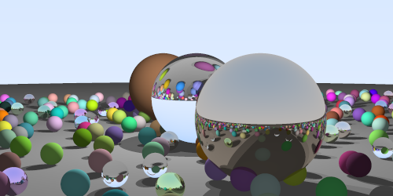</td>
  <td>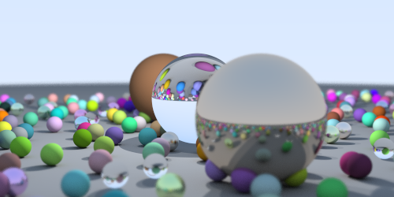</td>
</tr>
<tr>
  <td>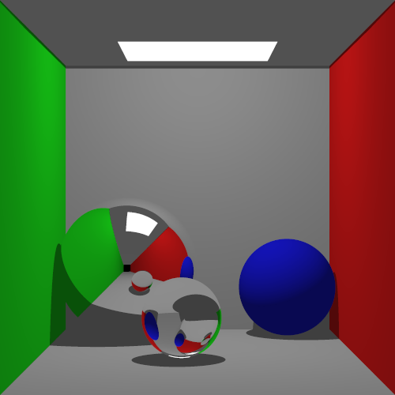</td>
  <td>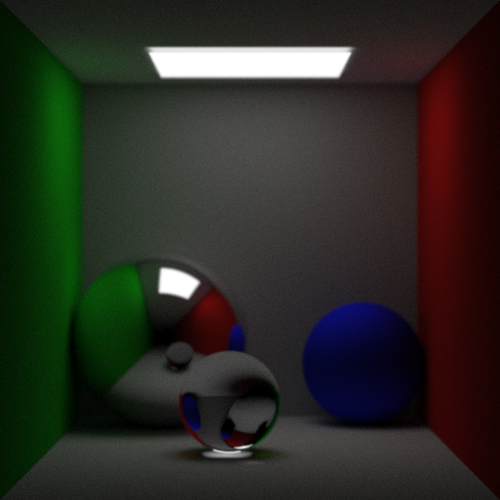</td>
</tr>
</table>

## Различные виды камер

### Ортогональная

<table>
<tr>
  <td>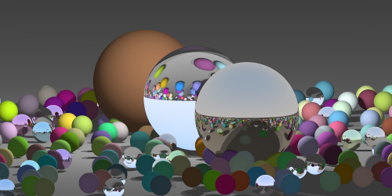</td>
  <td>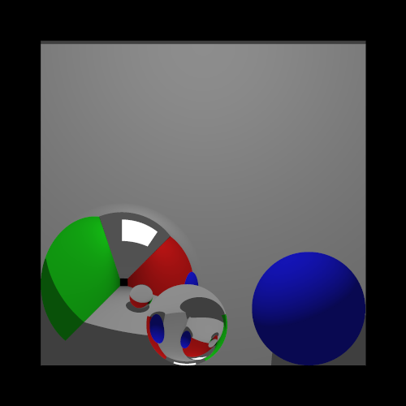</td>
</tr>
</table>

### 360 градусов

Эта камера создает такое изображение, которое запечатляет всю обстановку вокруг. Далее, по этому изображению можно получить сколько угодно изображений перспективной проекции, которые смотрят с разных углов при помощи различных программ для просмотра такого рода изображений.

Неизвестно, возможно ли добиться эффекта глубины резкости при использовании такой камеры.

Изображения в 360 градусов были просмотрены с помощью [www.chiefarchitect.com](https://www.chiefarchitect.com/products/360-panorama-viewer/)

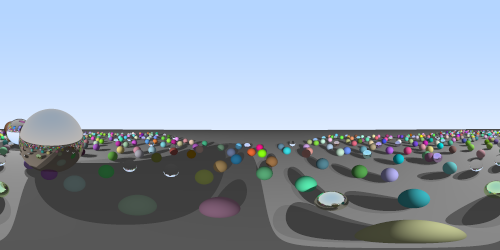
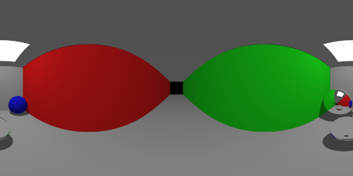
<table>
<tr>
  <td>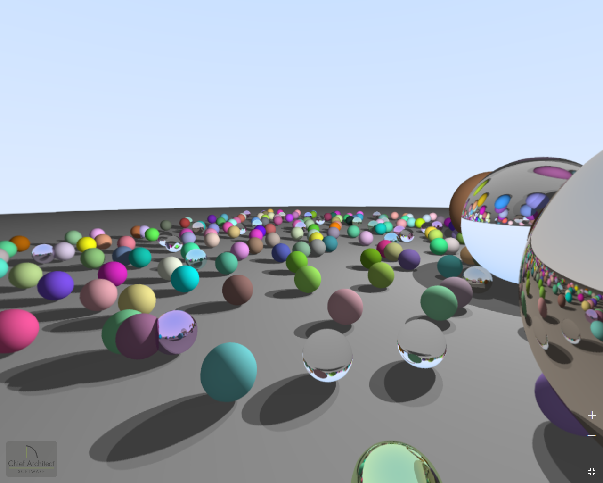</td>
  <td>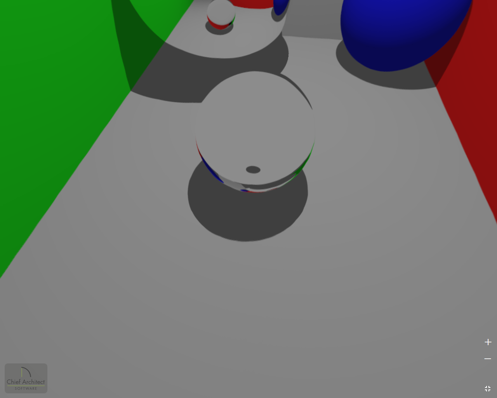</td>
</tr>
</table>

Большие версии изображений для просмотра на этом сайте находятся в папке `img` с названием `big`.

## Телепортация света через портал

Для path-tracing свет автоматически будет телепортироваться через порталы, как это просходит с отражениями и преломлениями света. Но точечный источник света - искусственный объект, и поддержку отражения в зеркальных материалах или преломление через стекляные объект надо добавлять отдельно. Именно таким отдельным вычислением и была добавлена телепортация света через порталы. Результат можно видеть на следующих изображениях.

Маленькой сферой показано положение точечного источника света. Темно-синий портал связан с красным, а голубой с оранжевым. Свет проходит через все порталы и освещает пол снизу. Так же некоторые части освещения от этого же источника света накладываются друг на друга, хотя источник света один. Эффект примерно такой же, как и от зеркал, но работает с порталами.

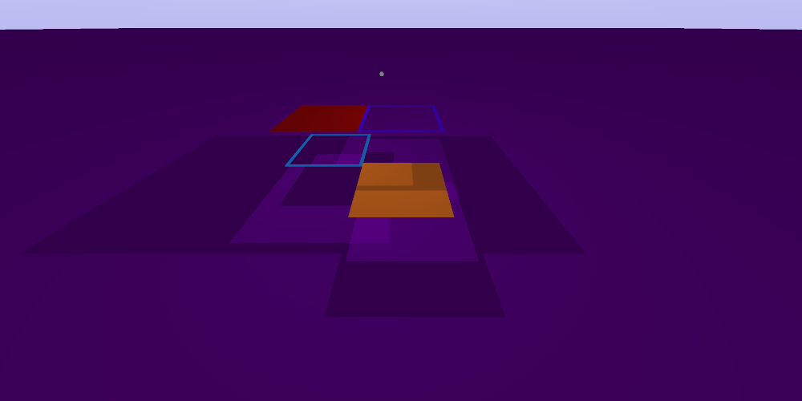

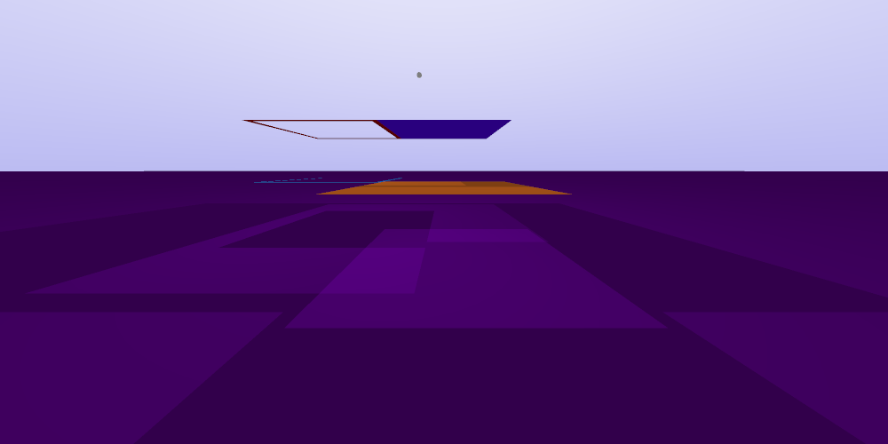

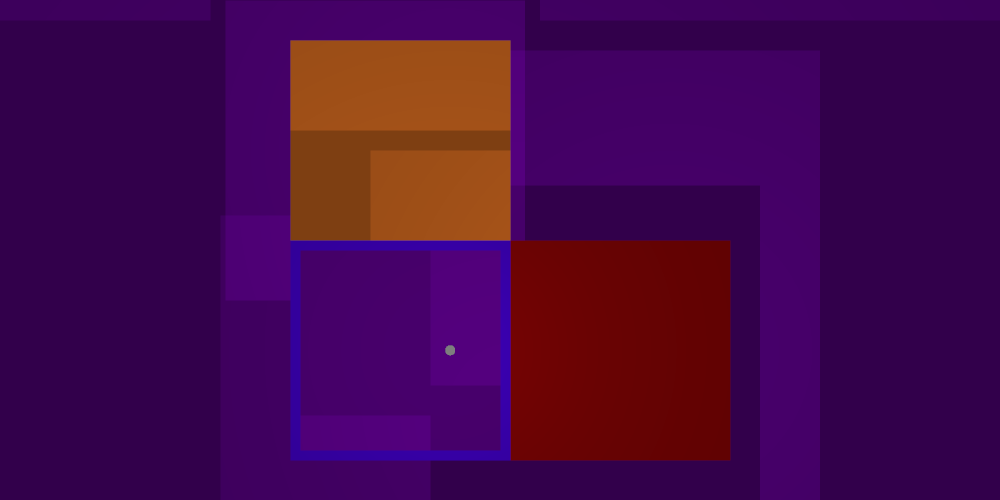

## Изображение глубины каждого пикселя

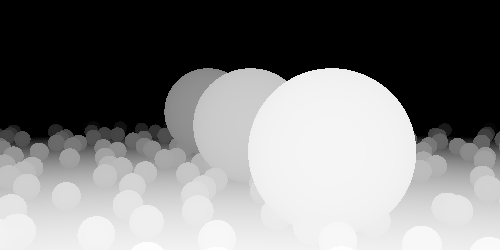

## Рендеринг произвольных полигонов

К сожалению тесселяция и дерево поиска не используется, поэтому принадлежность луча проверяется при помощи [pglauner/point_in_polygon](https://github.com/pglauner/point_in_polygon). Это работает очень медленно.

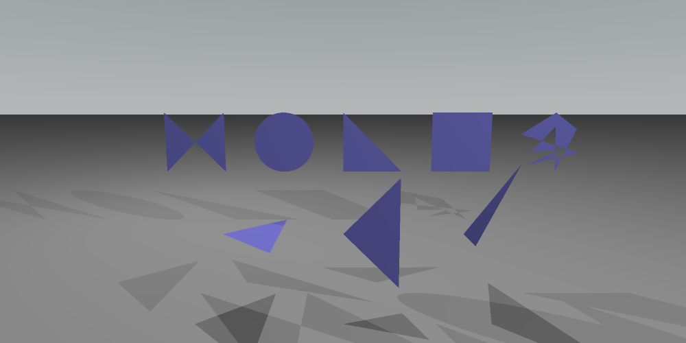

## Рендеринг сцен из portals_opengl

Производится с помощью `scene_raytracing`. Может так же анимацию при использовании данных перемещения пользовательской камеры, записанные в `portals_opengl` при нажатии кнопки `r`.

<table>
<tr>
  <td>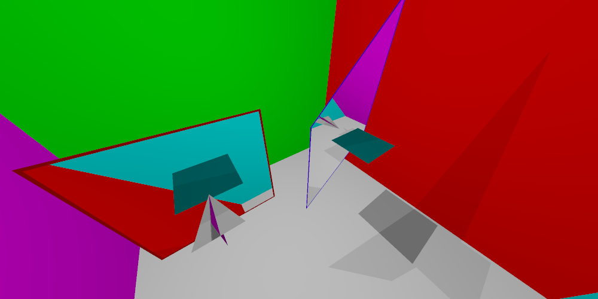</td>
  <td>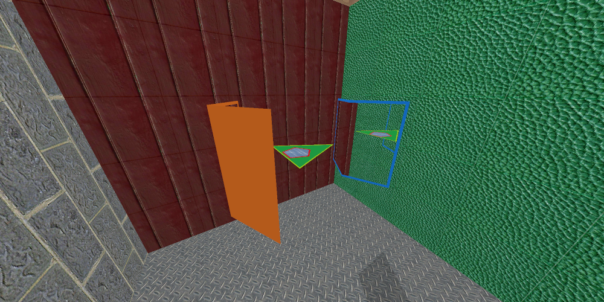</td>
</tr>
<tr>
  <td>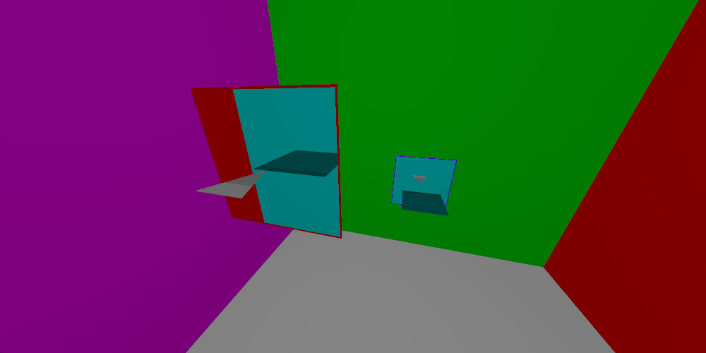</td>
  <td>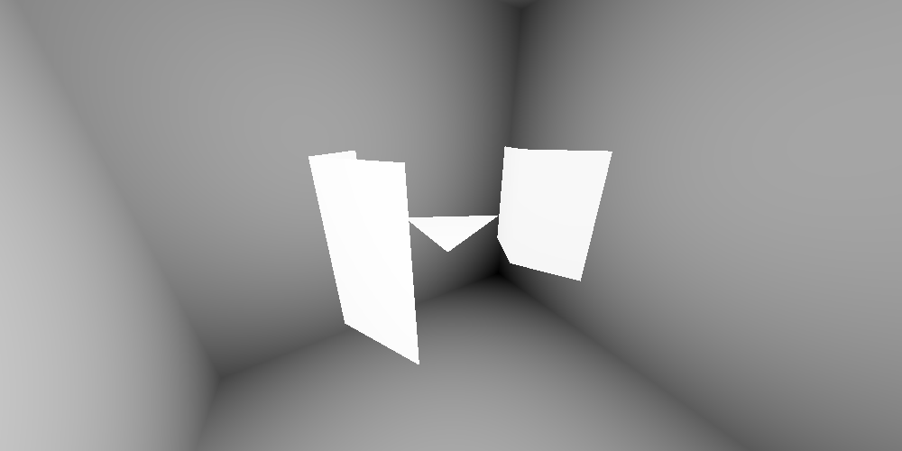</td>
</tr>
</table>

## Пример предсказания времени рендеринга

Так как рендеринг изображения при помощи **path tracing** может занимать часы, иногда бывает необходимо знать точное время рендеринга. Специально для этого каждые `n` отрендеренных пикселей собирается информация о времени рендеринга, находится процент завершенной работы и предсказывается время всего рендеринга. 

Очевидно, чтобы получить аппроксимацию времени, надо разделить прошедшее время на процент готовности работы.

Так же для увеличения точности, все пиксели для рендеринга берутся в случайном порядке. Если же не делать этого случайного выбора пикселей, то у нас на изображении, у которого сверху небо, а снизу сложная сцена, получится следующая картина: 
* верхняя часть (которая рендерится первой) будет отрендерена быстро, 
* а нижняя (которая идёт в конце), долго. 
Поэтому в начале рендеринга мы оптимистично будем полагать, что сцена рендерится 1 минуту, когда на самом деле выйдет 1 час (пример из реальной жизни).

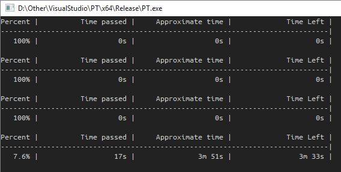

# Компиляция

Есть `CMakeLists.txt`, его можно использовать в `CMake`. Там же внутри указаны все зависимости.

Для scene_raytracing добавляется одна зависимость в виде `scene_reader` из [portals_opengl](https://github.com/optozorax/portals_opengl).